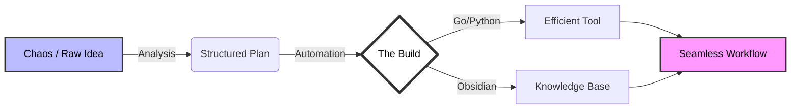

  <h1>ARRAMASS</h1>
  
<em>Orchestrating Efficiency on macOS</em>

---

### // The Architect

I don't just write code; I build ecosystems. My work bridges the gap between chaotic thoughts and structured automation. Specialize in crafting high-performance tools that operate silently in the background, empowering users to focus on what truly matters.

> *"Simplicity is the ultimate sophistication."*

---

### // Technical Arsenal

My toolkit is curated for speed, reliability, and aesthetics.

| **Core** | **Ecosystem** | **Tools & Workflow** |
| :--- | :--- | :--- |
|  | **macOS (Darwin)** |  |
|  | **Shell / Zsh** | **Neovim / VS Code** |
| **Swift** | **Docker** | **Git / GitHub** |

---

### // Blueprint

Here is how I approach problems:

---

### // Current Focus

- **Mole:** Forked from `tw93/mole`. Exploring advanced CLI architecture in Go.
- **Exam Automation Kit:** Python-based vision processing and automation.
- **Obsidian Sync:** Architecting a private, hybrid cloud knowledge base.

 

  

