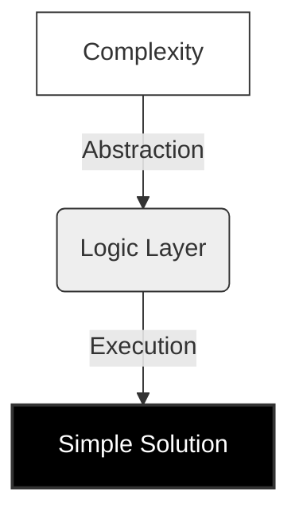

# Arramass

> *Digital Infrastructure & Automation*

---

### // Core

Designing systems where function dictates form. Focused on scalable architecture and automated reasoning.

---

### // Stack

`Go` &nbsp; `Python` &nbsp; `Shell`

 

