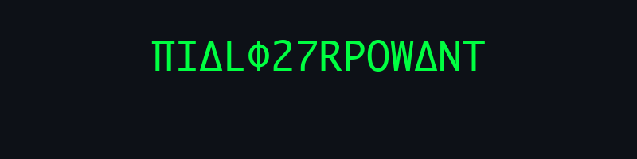

  <!-- Custom Generated Matrix Decoding Animation -->
  

 

  

  <code>>> SYSTEM_STATUS: ONLINE</code> 
  <code>>> TARGET: BUILDING_THE_FUTURE</code>

 

<!-- Snake Animation (The only game allowed in this terminal) -->

  

 

  <h3>⚡ NEURAL LINK / TECH STACK</h3>

  <!-- Minimalist, Dark & Green Badges -->
  
  
  
  
   
  
  
  
  

 

  <h3>📊 DATA STREAM</h3>

  <!-- Removed broken Streak Stats. Kept reliable main stats with transparent bg -->
  
  

 

  <code>EOF_</code>

